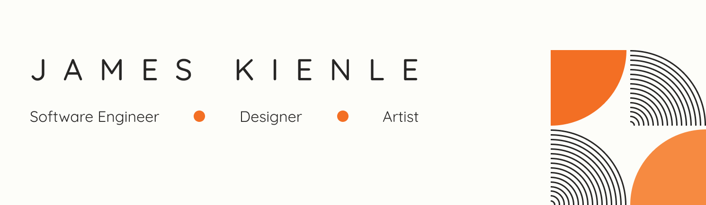

# Hi, I'm James!

Thanks for stopping by my GitHub profile! I'm a Principal Frontend Engineer at
[CareValidate](https://github.com/carevalidate/) and am developing
[Manatee](https://manateeengine.org), a Zig-based game engine in my free time. I have over a decade
of professional experience in startups all the way from pre-seed, to growth, all the way to
successful IPO / exits.

I've spent the majority of my career working in the health tech sector, and consider myself to be a
frontend-focused full stack engineer. Every day you'll find me writing TypeScript and Zig, immersed
in React, Solid, Vue, and TailwindCSS, building robust APIs with Node.js (I absolutely love pairing
this with Effect.ts), modeling PostgreSQL data with Drizzle and Prisma, and setting up bulletproof
AWS, Cloudflare, and GCP infrastructure with Terraform and CDK. I firmly believe that quality >>>
speed (but by prioritizing the right DX you can have both), and that comprehensive unit,
integration, and e:e tests are always a hard requirement (especially with the introduction of
agentic development).

## Open Source Work

I've recently began transitioning all of my open source work to Codeberg. If you're interested, I
have two primary Codeberg workspaces: [`jrkienle`](https://codeberg.org/jrkienle), which houses all
of my TypeScript and web development related work, and
[`manatee-interactive`](https://codeberg.org/manatee-interactive/), which houses all of my Zig and
game development related work.

## Professional Work

Interested in working with me? My resume is always up to date on
[LinkedIn](https://www.linkedin.com/in/jrkienle/), feel free to reach out to me there or on my
[Bluesky](https://bsky.app/profile/jrkienle.bsky.social).
